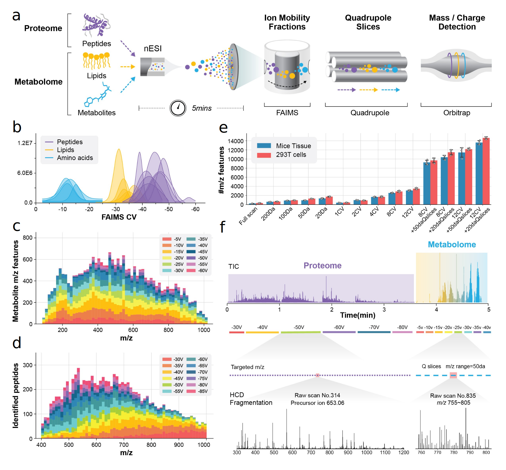

# Single-Injection Multi-Omics Analysis by Direct Infusion Mass Spectrometry(SMAD)  
Yuming Jiang1,2,3*, Ivan Salladay-Perez4, Amanda Momenzadeh1,2,3, Jose de Jesús Muñoz-Estrada1,2,3, Anthony J. Covarrubias4, Jesse G. Meyer1,2,3*  
1. Department of Computational Biomedicine, Cedars Sinai Medical Center, Los Angeles, CA 90048, USA.  
2. Advanced Clinical Biosystems Research Institute, Cedars Sinai Medical Center, Los Angeles, CA 90048, USA.  
3. Smidt Heart Institute, Cedars Sinai Medical Center, Los Angeles, CA 90048, USA.   
4. Department of Molecular Biology, Immunology, and Molecular Genetics, University of California, Los Angeles, 90095, USA.    

Abstract: Combined multi-omics analysis of proteomics, metabolomics, and lipidomics requires separate liquid chromatography–mass spectrometry (LC–MS), which limit throughput and increase costs, hindering the application of mass spectrometry-based multi-omics to large-scale analyses. Here, we present simultaneous multi-omics analysis by direct infusion (SMAD), an integrated platform leveraging ion mobility mass spectrometry and self-developed software tools to enable single injection multi-omics analysis without liquid chromatography. SMAD allows quantification of over 9,000 metabolite m/z features and over 1,300 proteins from the same sample in less than five minutes. We validated the efficiency and reliability of SMAD with three case studies. (1) mouse macrophages after M1/M2 polarization and senescence, (2) a pilot drug screen in human cells, and (3) large-scale high-throughput drug screening of mammalian cells in 96-well plates. Finally, relationships between proteomic and metabolomic data are discovered by machine learning and validated. 

